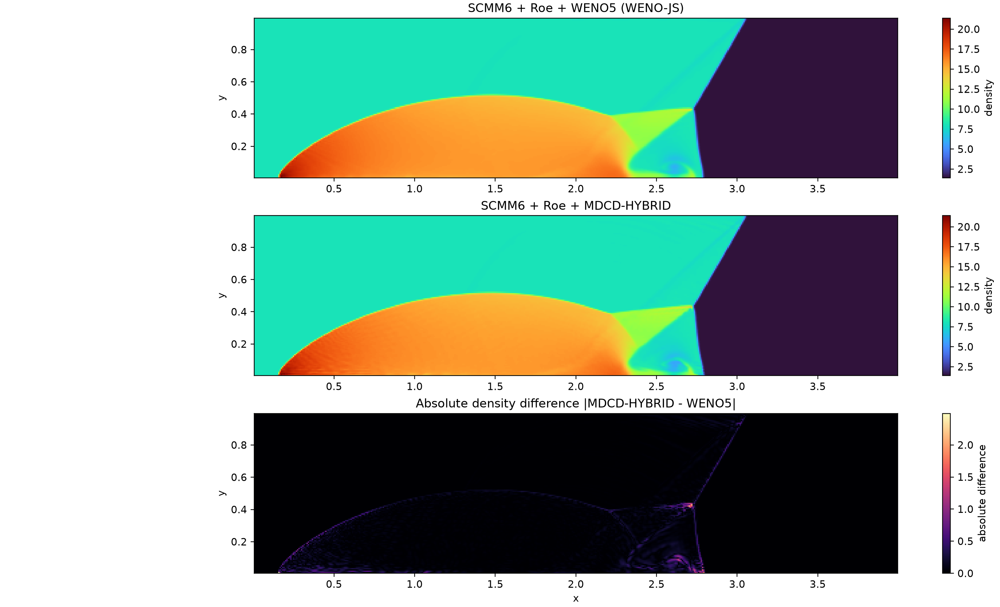
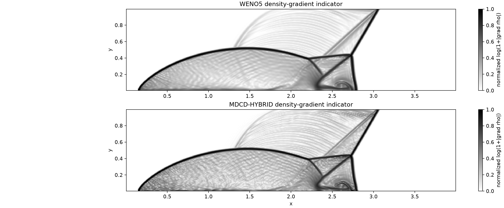
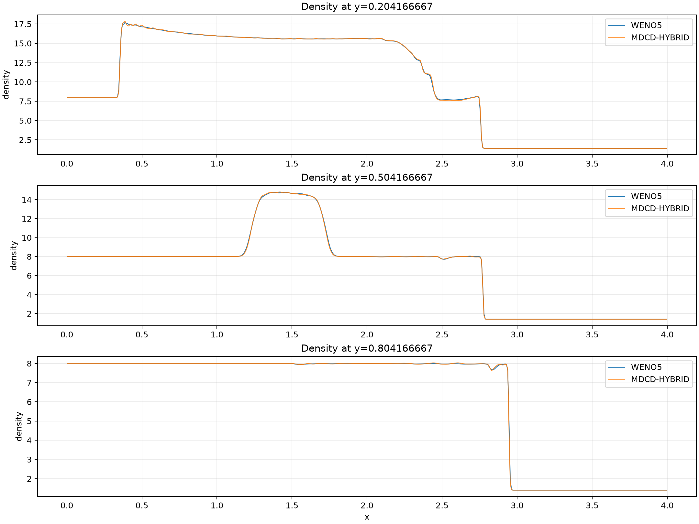
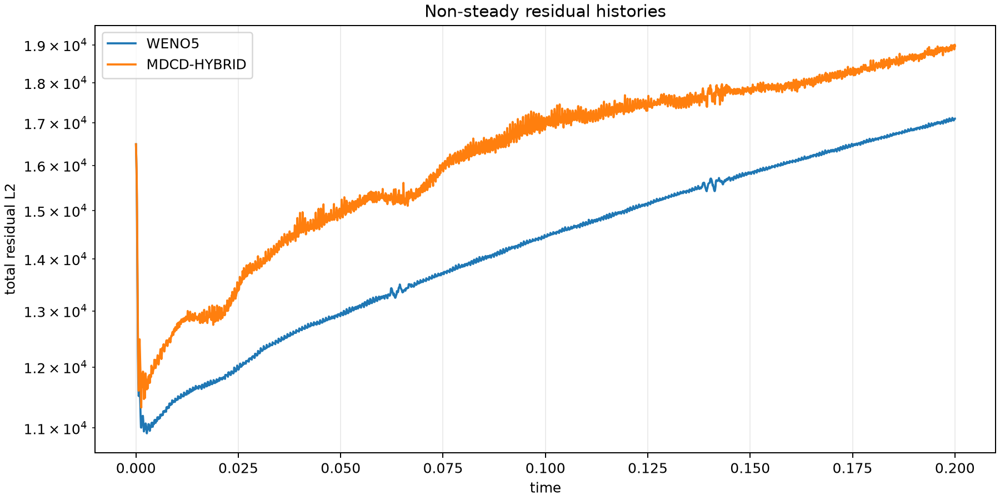
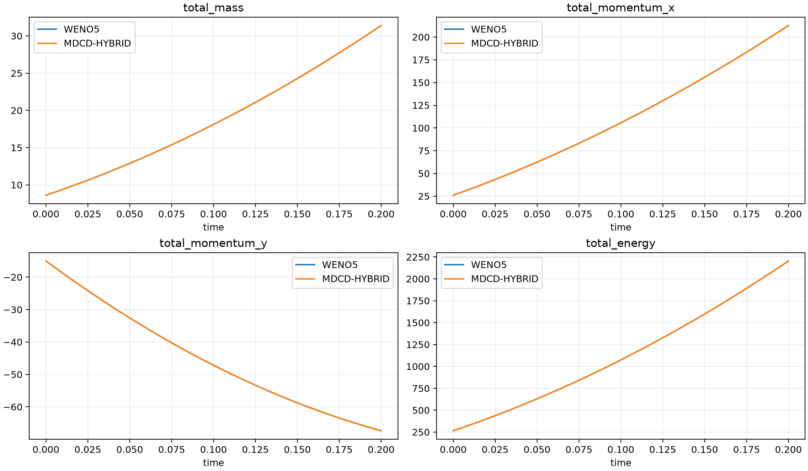

# Case04 双马赫反射实际计算与算法比较报告

## 1. 结论与适用范围

2026-09-10 在 Windows 本机使用 16 个 Intel MPI rank 完成两组二维经典双马赫反射计算，
两组都精确推进到无量纲时间 `t=0.2`：

| 项目 | WENO5 | MDCD_HYBRID |
|---|---:|---:|
| 配置 | `scmm6_roe_weno5_480x120.wcns` | `scmm6_roe_mdcd_hybrid_480x120.wcns` |
| 最终步数 | 3078 | 3124 |
| 最终时间 | 0.2 | 0.2 |
| 停止原因 | `physical_time_reached` | `physical_time_reached` |
| 求解器报告墙钟时间 | 2204.890458 s | 1864.029776 s |
| MPI rank | 16 | 16 |
| 程序提交 | `cabcdc6df357` | `cabcdc6df357` |

两组均使用：SCMM6 几何度量路径、特征变量六点界面重构、Roe Riemann 求解器、
CFL 0.2、SSPRK 时间推进、同一 480×120 四块均匀网格和同一初边值条件。
本文的“WENO5”专指经典 Jiang--Shu 五阶 WENO，即程序键 `weno_js`。

必须明确一个重要限定：正式完成结果显式设置了
`algorithm.flux_difference=conservative_two_point`。这意味着几何度量属于
`scmm6_wcns`，界面仍由 WENO5/MDCD_HYBRID 重构并由 Roe 求通量，但通量散度使用相邻
真实面的守恒两点差，而不是 SCMM6 profile 的纯六阶 `D6`。因此本次结果通过了
“SCMM6 度量 + Roe + 两种高阶界面重构”的强激波可行性验收，却不能作为“纯 SCMM6-D6
通量差分已通过双马赫反射”的证据。

## 2. 为什么增加显式守恒两点差分

最初按严格 `algorithm.flux_difference=profile` 使用 SCMM6 的 `D6` 通量差分。强激波足
附近出现负内能：诊断定位到第一个原生块的 `cell=(41,0,0)`，即初始激波与下壁交点右侧。
降低 CFL 只能推迟步数，不能消除接近相同物理时刻的失败：

| 试验 CFL | 现象 |
|---:|---|
| 0.2 | 初始推进即失败 |
| 0.05 | 完成 1 步后失败 |
| 0.01 | 完成 6 步后仍在约 `t=1.23e-5` 失败 |

进一步把重构依次改为 WENO5、MDCD_HYBRID、primitive 变量以及保持六点调用模板的
`zero_order`，故障位置和性质基本不变。这说明主因不是某一种非线性重构，而是强间断下
高阶中心通量差分尾系数将大通量传到相邻多点后缺少正性保证。程序没有用密度/压力截断或
修改守恒量来掩盖问题。

为使算例可计算且保持共享面守恒，新增了显式模式：

\[
\left.\frac{dU_i}{dt}\right|_{\xi}
=-\frac{\widehat F_{i+1/2}-\widehat F_{i-1/2}}{J_i}.
\]

默认值仍是 `profile`，原 PHengLEI D4/D2 和 SCMM6 D6/D4 路径没有被静默改变。
新模式进入配置摘要和 restart signature；用户必须主动选择，报告也必须注明降阶。
若后续要求严格完成纯 D6 版本，需要另行实现并验证保正通量限制、激波传感混合差分或等价
的强激波稳定化，而不能把本结果直接改名。

## 3. 算例定义

计算域与气体参数为

\[
(x,y)\in[0,4]\times[0,1],\qquad \gamma=1.4.
\]

初始 Mach 10 激波与 x 轴成 60°，在下壁的激波足为 `x0=1/6`。移动激波线为

\[
x_s(y,t)=\frac16+\frac{y}{\sqrt3}+\frac{20t}{\sqrt3}.
\]

激波前、后状态分别为

\[
(\rho,u,v,w,p)_0=(1.4,0,0,0,1),
\]

\[
(\rho,u,v,w,p)_1=
\left(8,8.25\frac{\sqrt3}{2},-4.125,0,116.5\right).
\]

左边界给激波后态；顶边界按 RK 子步时间和移动激波线给定；下边界在 `x<x0` 给激波后态，
在 `x>=x0` 为滑移反射壁；右边界为外流。计算无粘、无源项。

网格共有 480×120 个单元，`dx=dy=1/120`。CGNS 文件沿 x 方向含 4 个原生 zone，
每个 zone 为 120×120。`auto_split` 又把每个 zone 分成 4 个 60×60 叶块，最终 16 个叶块
分别分配给 16 个 rank。该布置同时检验原生多块连接和 rank 数多于原生 zone 数时的继续剖分。

## 4. 数值配置的唯一差异

共同配置如下：

```text
algorithm.profile = scmm6_wcns
algorithm.flux_difference = conservative_two_point
algorithm.reconstruction_variables = characteristic
algorithm.riemann = roe
run.cfl = 0.2
run.t_end = 0.2
run.max_steps = 1000000
```

WENO5 组只设置：

```text
algorithm.reconstruction = weno_js
```

MDCD 组只设置：

```text
algorithm.reconstruction = mdcd_hybrid
algorithm.mdcd.disp = 0.0463783
algorithm.mdcd.diss = 0.01
```

除重构算法及 MDCD 专属参数外，网格、物理问题、边界、Roe、CFL、MPI 分区和输出调度一致。

## 5. 执行命令

从仓库根目录重新配置并构建，使 manifest 写入里程碑提交：

```powershell
cmake -S . -B build-rc-mpi -DWCNS_ENABLE_MPI=ON -DCMAKE_BUILD_TYPE=Release
cmake --build build-rc-mpi --config Release -j16
```

先执行两组 dry-run，再正式连续运行与比较：

```powershell
python cases/manual/case04_2d_double_mach_reflection/run_case04_comparison.py `
  --method both --clean --ranks 16 `
  --mpi-exec "C:\Program Files (x86)\Intel\oneAPI\mpi\latest\bin\mpiexec.exe"
```

首次后处理发现 Tecplot 四个 zone 对同一 y 坐标存在舍入级表示差，脚本错误地把它们当成
不同网格线。求解和机器验证已经完成，仅绘图失败。修正为按相对尺度 `1e-12` 聚类坐标后，
使用下式只重做验证和后处理，没有重算或修改终场：

```powershell
python cases/manual/case04_2d_double_mach_reflection/run_case04_comparison.py `
  --method both --postprocess-only
```

## 6. 机器验收

两组终场的全部输出量均有限且热力学量保持正值：

| 检查 | WENO5 | MDCD_HYBRID |
|---|---:|---:|
| 样本数（7 个字段） | 403200 | 403200 |
| 最小密度 | 1.3999987668 | 1.3999988196 |
| 最小压力 | 0.9999987658 | 0.9999988311 |
| 最小温度 | 0.7142854619 | 0.7142854816 |
| CGNS/Tecplot 最大绝对差 | 1.77636e-15 | 1.77636e-15 |

CGNS/Tecplot 一致性容差为 `1e-12`，两组均通过。两组终场 CGNS 的四个 zone 坐标完全一致，
比较器报告 `max_coordinate_difference=0`。

Roe 求解器在所有写入 history 的残差评估中均无回退。重构回退字段是“当前一次已报告
残差评估的全局回退面数”，不是累计计数：

| 诊断 | WENO5 | MDCD_HYBRID |
|---|---:|---:|
| 单次残差评估最大重构回退数 | 3 | 3 |
| 出现重构回退的 history 行数 | 9 / 3079 | 121 / 3125 |
| 各已报告行回退数之和 | 21 | 170 |
| 单次残差评估最大 Roe 回退数 | 0 | 0 |

MDCD_HYBRID 在最强间断附近更频繁触发确定性重构降阶。因此其终场不是“每个面始终使用
MDCD”的理想化结果；这是正性保护策略的实际工作记录，而不是静默忽略。

## 7. 终场定量比较

以 WENO5 为参考、对 57600 个单元作无权均方比较：

| 字段 | L1 差 | L2 差 | Linf 差 | 相对 L2 |
|---|---:|---:|---:|---:|
| 密度 | 2.01380e-2 | 6.96926e-2 | 2.49122 | 7.43288e-3 |
| 压力 | 3.93595e-1 | 1.56876 | 84.5243 | 9.12701e-3 |
| 温度 | 2.60757e-2 | 1.44384e-1 | 13.8629 | 1.01678e-2 |
| x 速度 | 1.24804e-2 | 6.48932e-2 | 5.65332 | 1.05175e-2 |
| y 速度 | 1.04873e-2 | 3.82330e-2 | 1.59787 | 1.37563e-2 |
| Mach 数 | 2.75314e-3 | 1.35333e-2 | 0.666038 | 9.47541e-3 |
| entropy proxy | 1.13211e-2 | 7.37832e-2 | 6.37257 | 1.32070e-2 |

密度范围为 WENO5 `[1.39999877, 21.39096417]`、MDCD_HYBRID
`[1.39999882, 21.09113085]`。最大密度梯度指标分别为 917.4844 和 931.3315，MDCD 比
WENO5 高约 1.51%，表明在该网格和稳定化设置下 MDCD 的最尖锐局部结构略强；另一方面，
WENO5 的密度峰值更高。Linf 差主要集中在激波、三重点和近壁射流等发生轻微位置偏移的区域，
不应解释为整个流场具有同等大小的偏差。

三个水平截面的密度差为：

| 目标 y | 实际单元中心 y | L2 差 | Linf 差 |
|---:|---:|---:|---:|
| 0.2 | 0.2041666667 | 0.0595257 | 0.450287 |
| 0.5 | 0.5041666667 | 0.0357110 | 0.237007 |
| 0.8 | 0.8041666667 | 0.0255125 | 0.451064 |

终场全场积分非常接近。该问题有持续的物理边界通量，总量随时间变化是正确现象，表中只比较
两种离散方法的一致性：

| 统计量 | WENO5 | MDCD_HYBRID | MDCD-WENO5 | 相对差 |
|---|---:|---:|---:|---:|
| 总质量 | 31.40285425 | 31.40267651 | -1.77740e-4 | -5.65999e-6 |
| 总 x 动量 | 212.69467662 | 212.68577863 | -8.89798e-3 | -4.18345e-5 |
| 总 y 动量 | -67.37602977 | -67.37691516 | -8.85389e-4 | -1.31410e-5 |
| 总能量 | 2203.80460137 | 2203.64213510 | -1.62466e-1 | -7.37208e-5 |

## 8. 图像检查











两组都能看到入射激波、Mach stem、反射激波、三重点、滑移线和下壁附近卷起结构。
按移动激波关系，`t=0.2,y=1` 时顶边界交点约为 `x=3.0534`，图中顶边界激波位置与之
一致。四个原生 zone 接口位于 `x=1,2,3`；除真实流动结构外未见沿接口贯穿全高的数值接缝。

残差随时间总体上升不代表发散：这是持续有移动激波进入、且目标为瞬态终场的非定常问题，
并未采用定常残差收敛停止。两组 CFL 时间步始终为正；history 中的最小时间步发生在
`t=0.05,0.10,0.15,0.20` 输出事件附近，是事件时间裁剪，不是 CFL 崩塌。

## 9. 本次为完成实际计算所作的程序修改

本次没有偷偷修改终场数据。程序和工具改动如下，正式结果的 manifest 均绑定提交
`cabcdc6df357`：

1. 新增 `algorithm.flux_difference=profile|conservative_two_point`；默认仍为 `profile`。
2. 在无粘和粘性求解器的无粘部分接入该模式，并纳入摘要与 restart signature。
3. 数值异常现在输出 rank、推进阶段、block、cell 和守恒量，便于定位负内能。
4. 将无状态内置重构策略改为复用静态实例，移除逐面注册工厂和动态分配的生产热点；
   数学公式、模板和回退次序没有改变。
5. 比较配置增加 480×120 中等分辨率版本；960×240 配置保留为后续高分辨率模板。
6. 修复多 zone Tecplot 后处理的舍入级坐标聚类，并新增 `--postprocess-only`，使求解完成而
   绘图失败时无需覆盖或重算结果。
7. 新增密度/梯度/截面、非定常残差和全场积分对比图及 JSON 汇总。
8. 用户手册与 `算法补充.md` 已明确两点差分的精度和命名限制。

完整 Release+MPI 回归测试为 82/82 通过。尚未修复的已知问题是：若某个 MPI rank 在 halo
通信前后单独触发数值异常，当前错误同步路径仍可能使其他 rank 停留在通信中；本次稳定运行
没有触发该路径，但后续应设计分阶段集体失败协议。

## 10. 文件、校验和与复现证据

关键 SHA-256：

| 文件 | SHA-256 |
|---|---|
| `grids/double_mach_480x120.cgns` | `C0434EC1D5A8B845E5518FB16D47990A97E10FF4D0314FFA55A425DE7E838B08` |
| WENO5 终场 CGNS | `8D1B0C2EE5BD75F84116F272FCF607386971218E7A2047D0D26AB560E838BDE2` |
| MDCD_HYBRID 终场 CGNS | `10D163E5B8A09922874BC6B898C5C3A4A09FD678DA2064D34BB9CCDB0FDECA15` |

目录含义：

- `results/scmm6_roe_weno5_480x120/`：WENO5 的终场 CGNS/Tecplot、history、statistics、
  manifest 和 0.05 间隔检查点。
- `results/scmm6_roe_mdcd_hybrid_480x120/`：MDCD_HYBRID 的对应文件。
- `logs/comparison/`：两组 dry-run 和正式运行的逐步标准输出。
- `validation/comparison/`：有限性、CGNS/Tecplot 一致性、两场误差、后处理日志和运行摘要。
- `comparison/`：图像、水平截面 CSV 和机器可读 `comparison-summary.json`。

本次验收结论分两层：稳定的 SCMM6 度量/Roe/两点守恒通量差分计算与 WENO5--MDCD
对比已经完成；严格 SCMM6-D6 强激波验收仍未完成，需在后续加入经验证的保正高阶策略。
